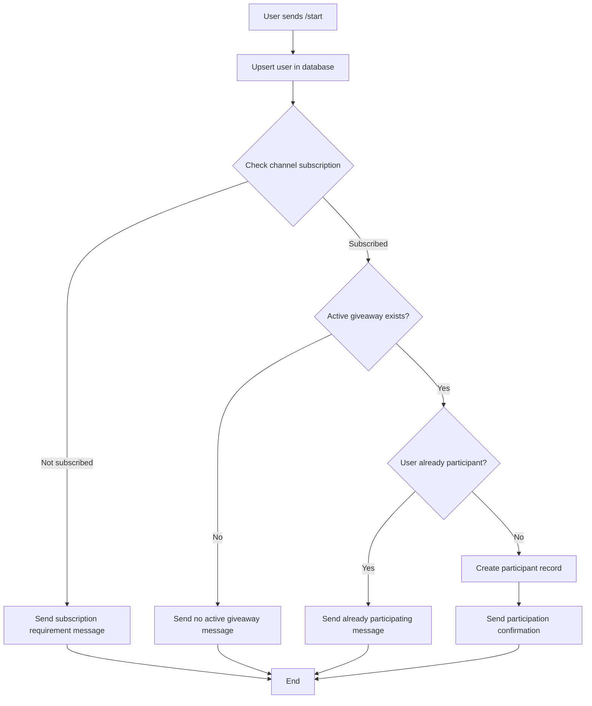
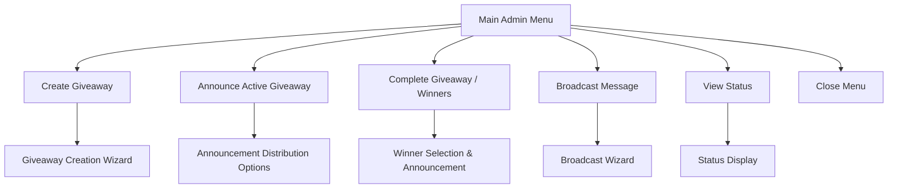
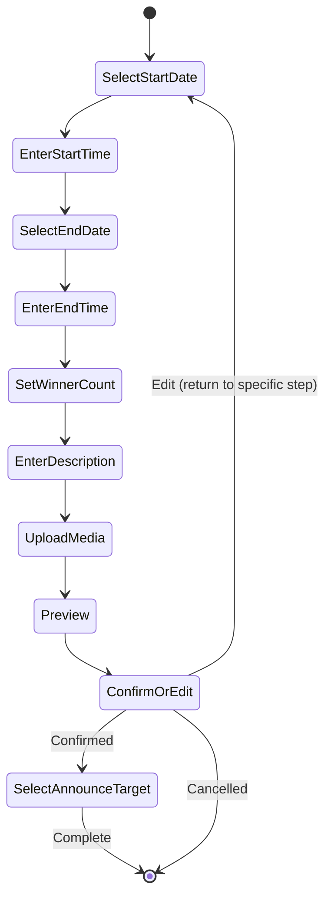
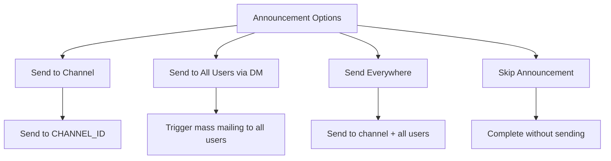
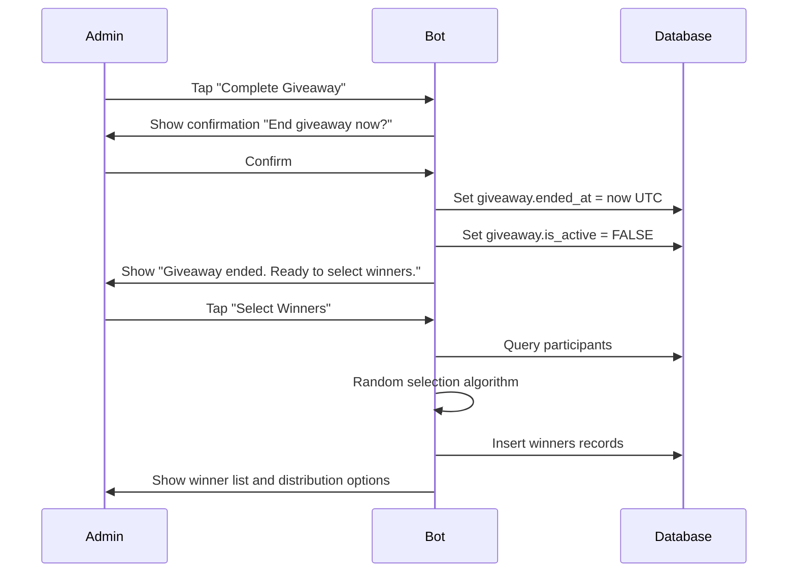
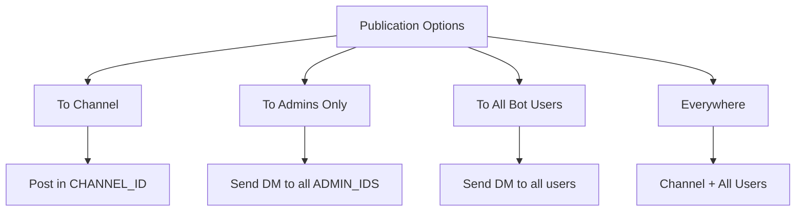
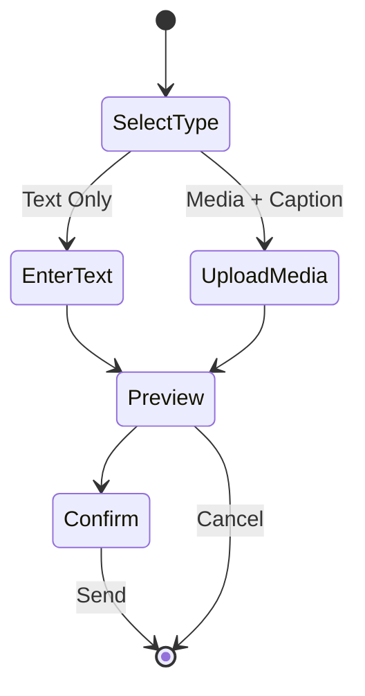

# Telegram Giveaway Bot - Design Document

## Project Overview

A fully functional Telegram bot for managing giveaways with an admin panel built entirely on inline buttons. The bot provides user participation through subscription verification and comprehensive admin controls via a step-by-step wizard interface.

### Core Objectives

- Enable user participation in giveaways via `/start` command with channel subscription verification
- Provide admin management exclusively through private messages using `/admin` command with inline button navigation
- Store all texts and settings in separate JSON files for easy configuration
- Support optional Google Sheets synchronization for data backup
- Ensure scalability from 1K users to larger audiences with robust rate limiting

### Target Timezone

All user-facing dates and times displayed in **Europe/Moscow** timezone, while internal storage uses UTC.

## Technology Stack

### Core Technologies

| Component | Technology | Version |
|-----------|-----------|---------|
| Programming Language | Python | 3.12 |
| Telegram Framework | aiogram | 3.x |
| State Management | Redis | Latest stable |
| Database | PostgreSQL | 16+ |
| ORM | SQLAlchemy | 2.0 (async) |
| Database Driver | asyncpg | Latest |
| Migrations | Alembic | Latest |
| Configuration | Pydantic Settings | Latest |

### Development & Quality Assurance

| Tool | Purpose |
|------|---------|
| ruff | Linting and formatting |
| mypy | Type checking (optional) |
| pytest + pytest-asyncio | Testing framework |
| GitHub Actions | CI/CD pipeline |

### Deployment

| Method | Description |
|--------|-------------|
| Docker + docker-compose | Primary deployment method |
| systemd | Alternative deployment option |

## System Architecture

### Project Structure

```
bot/
├── main.py                         # Application entry point
├── config/
│   ├── settings.py                 # Environment and config.json loader
│   └── config.json                 # Non-secret configuration
├── messages/
│   ├── messages.json               # All bot text content
│   └── i18n.py                     # Text retrieval function t(key, **kwargs)
├── db/
│   ├── base.py                     # Database engine and session management
│   ├── models.py                   # SQLAlchemy models
│   ├── migrations/                 # Alembic migration files
│   └── repo/                       # Repository layer for CRUD operations
├── handlers/
│   ├── start.py                    # /start command handler
│   └── admin/
│       ├── entry.py                # /admin command entry point
│       ├── menu.py                 # Main admin menu
│       ├── giveaway_wizard.py      # Giveaway creation wizard
│       ├── announce.py             # Announcement distribution
│       ├── winners.py              # Winner selection and announcement
│       └── broadcast_wizard.py     # Broadcast message wizard
├── services/
│   ├── subscription.py             # Channel subscription verification
│   ├── mailing.py                  # Mass messaging with rate limiting
│   ├── giveaway_service.py         # Giveaway business logic
│   └── sheets_sync.py              # Optional Google Sheets synchronization
└── keyboards/
    ├── admin.py                    # Admin inline keyboards
    └── common.py                   # Common navigation keyboards
```

### Architectural Principles

| Principle | Implementation |
|-----------|----------------|
| Admin Access Control | All admin actions only accessible in private messages; group/channel admin messages ignored |
| Wizard Pattern | All multi-step processes implemented via FSM with inline buttons |
| State Persistence | FSM states in Redis, draft data in database for crash recovery |
| Separation of Concerns | Clear boundaries between handlers, services, and data access layers |
| Configuration Externalization | All texts in messages.json, settings in config.json, secrets in .env |

## Configuration Management

### Configuration Files Structure

#### config.json - Non-Secret Settings

Purpose: Store all behavioral and operational settings without sensitive data.

| Setting Group | Parameters | Description |
|--------------|------------|-------------|
| timezone | "Europe/Moscow" | Fixed timezone for date/time display |
| join_url | URL string | Participation button link |
| rate_limits | broadcast_rps, announce_rps, burst, max_retries | Mass mailing rate control parameters |
| admin_panel | UI configuration | Optional admin interface customization |
| sheets_sync | enabled, flush_sec, max_updates, max_appends, max_deletes | Google Sheets sync configuration |

Example structure:

```
timezone: Europe/Moscow
join_url: bot start link with payload
rate_limits:
  - broadcast_rps: 20 messages per second
  - announce_rps: 20 messages per second
  - burst: 5 concurrent messages
  - max_retries: 5 retry attempts
sheets_sync:
  - enabled: true/false
  - flush_sec: 1.0 seconds between flushes
  - max_updates: 200 per batch
  - max_appends: 200 per batch
  - max_deletes: 200 per batch
```

#### messages.json - Bot Text Content

Purpose: Centralize all user-facing text strings with parameter substitution support.

Structure: Key-value pairs where values support {parameter} formatting.

Access Method: `t(key, **kwargs)` function retrieves and formats text.

Categories:
- User messages: participation confirmation, subscription requirements
- Admin menu: button labels, navigation prompts
- Wizard steps: instructions, validation errors
- System messages: errors, success confirmations

#### .env - Secret Configuration

Purpose: Store sensitive credentials outside repository.

Required Variables:
- BOT_TOKEN: Telegram bot API token
- DATABASE_URL: PostgreSQL connection string
- REDIS_URL: Redis connection string
- ADMIN_IDS: Comma-separated list of admin user IDs
- CHANNEL_ID: Channel ID for subscription verification
- GOOGLE_CREDENTIALS_PATH: Path to service account JSON (if Sheets sync enabled)
- SPREADSHEET_ID: Google Sheets ID (if sync enabled)

Security Requirements:
- Never commit .env to repository
- Use .env.example as template
- Store production secrets in secure vault or secret management system

## Data Model

### Database Schema

#### users Table

Purpose: Store all bot users for participation and messaging.

| Column | Type | Constraints | Description |
|--------|------|-------------|-------------|
| user_id | BIGINT | PRIMARY KEY | Telegram user ID |
| username | VARCHAR(255) | NULLABLE | Telegram username (may change or be absent) |
| joined_at | TIMESTAMP | NOT NULL | First interaction timestamp (UTC) |

Indexes:
- PRIMARY KEY on user_id
- INDEX on joined_at for analytics

#### giveaways Table

Purpose: Store giveaway configurations and metadata.

| Column | Type | Constraints | Description |
|--------|------|-------------|-------------|
| id | SERIAL | PRIMARY KEY | Giveaway unique identifier |
| start_at | TIMESTAMP | NOT NULL | Start time in UTC |
| end_at | TIMESTAMP | NOT NULL | End time in UTC |
| description | TEXT | NOT NULL | Giveaway description visible to users |
| num_winners | INTEGER | NOT NULL, CHECK > 0 | Number of winners to select |
| is_active | BOOLEAN | NOT NULL, DEFAULT TRUE | Whether giveaway is currently active |
| announce_text | TEXT | NULLABLE | Custom announcement text (optional) |
| announce_media_file_id | VARCHAR(255) | NOT NULL | Telegram file_id for announcement media |
| created_by_admin_id | BIGINT | NOT NULL | Admin user_id who created giveaway |
| created_at | TIMESTAMP | NOT NULL | Creation timestamp (UTC) |
| ended_at | TIMESTAMP | NULLABLE | Actual end timestamp if manually ended |

Indexes:
- PRIMARY KEY on id
- INDEX on is_active for active giveaway queries
- INDEX on end_at for scheduled completion checks

Business Rules:
- Only one giveaway can have is_active=TRUE at a time
- end_at must be greater than start_at
- announce_media_file_id is mandatory per requirements

#### participants Table

Purpose: Track user participation in giveaways.

| Column | Type | Constraints | Description |
|--------|------|-------------|-------------|
| id | SERIAL | PRIMARY KEY | Participant record ID |
| giveaway_id | INTEGER | FOREIGN KEY, NOT NULL | Reference to giveaways.id |
| user_id | BIGINT | FOREIGN KEY, NOT NULL | Reference to users.user_id |
| joined_at | TIMESTAMP | NOT NULL | Participation timestamp (UTC) |
| username_snapshot | VARCHAR(255) | NULLABLE | Username at participation time |
| giveaway_end_snapshot | TIMESTAMP | NOT NULL | Snapshot of giveaway end_at |

Indexes:
- PRIMARY KEY on id
- UNIQUE INDEX on (giveaway_id, user_id) - prevent duplicate participation
- INDEX on giveaway_id for winner selection queries
- INDEX on user_id for user participation history

Foreign Keys:
- giveaway_id REFERENCES giveaways(id) ON DELETE CASCADE
- user_id REFERENCES users(user_id) ON DELETE CASCADE

#### winners Table

Purpose: Store selected winners with immutable snapshot data.

| Column | Type | Constraints | Description |
|--------|------|-------------|-------------|
| id | SERIAL | PRIMARY KEY | Winner record ID |
| giveaway_id | INTEGER | FOREIGN KEY, NOT NULL | Reference to giveaways.id |
| user_id | BIGINT | FOREIGN KEY, NOT NULL | Reference to users.user_id |
| username_snapshot | VARCHAR(255) | NULLABLE | Username at selection time |
| giveaway_end_snapshot | TIMESTAMP | NOT NULL | End time snapshot |
| created_at | TIMESTAMP | NOT NULL | Winner selection timestamp (UTC) |

Indexes:
- PRIMARY KEY on id
- UNIQUE INDEX on (giveaway_id, user_id) - one user can only win once per giveaway
- INDEX on giveaway_id for winner retrieval

Foreign Keys:
- giveaway_id REFERENCES giveaways(id) ON DELETE CASCADE
- user_id REFERENCES users(user_id) ON DELETE CASCADE

#### admin_drafts Table

Purpose: Persist admin wizard progress for crash recovery.

| Column | Type | Constraints | Description |
|--------|------|-------------|-------------|
| id | SERIAL | PRIMARY KEY | Draft record ID |
| admin_id | BIGINT | NOT NULL | Admin user_id |
| type | VARCHAR(50) | NOT NULL | Draft type: "giveaway_create" or "broadcast" |
| payload | JSONB | NOT NULL | Collected wizard data |
| status | VARCHAR(50) | NOT NULL | "in_progress", "ready_preview", "cancelled" |
| updated_at | TIMESTAMP | NOT NULL | Last update timestamp (UTC) |

Indexes:
- PRIMARY KEY on id
- UNIQUE INDEX on (admin_id, type) WHERE status='in_progress' - one active draft per type per admin
- INDEX on updated_at for TTL cleanup

Lifecycle:
- Created when wizard starts
- Updated at each step
- Deleted after wizard completes or cancels
- Automatic cleanup of drafts older than N days via scheduled task

### State Management Strategy

#### FSM in Redis

Purpose: Track current conversation state and step within wizards.

Storage:
- Key: user/admin Telegram ID
- Value: Current state identifier
- TTL: Configurable (e.g., 1 hour of inactivity)

Advantages:
- Fast access for high-frequency state checks
- Automatic cleanup via TTL
- Survives brief restarts with Redis persistence

#### Draft Data in Database

Purpose: Persist collected wizard data for reliability.

Storage: admin_drafts table with JSONB payload

Advantages:
- Survives bot crashes and Redis flushes
- Enables draft resumption after restart
- Provides audit trail of incomplete wizards

Combined Approach:
- FSM state in Redis indicates current wizard step
- Draft data in database stores collected information
- On wizard start: check for existing draft and offer resume
- On each step: update both FSM state and draft payload
- On completion: delete draft and clear FSM state

## User Workflow

### User Participation Flow



### User Participation Steps

| Step | Action | System Response |
|------|--------|-----------------|
| 1 | User sends `/start` command | Bot records user information (upsert user_id and username) |
| 2 | System checks subscription | Verify user is member of configured CHANNEL_ID |
| 3a | Not subscribed | Send message from messages.json with subscription link |
| 3b | Subscribed, no active giveaway | Send message indicating no active giveaway |
| 3c | Subscribed, active giveaway exists | Check if user already participated |
| 4 | First participation | Create participant record with username_snapshot and giveaway_end_snapshot |
| 5 | Send confirmation | Display participation confirmation with giveaway details |

### Subscription Verification Logic

Service: `subscription.py`

Method: `check_subscription(user_id: int) -> bool`

Process:
- Call Telegram API `getChatMember` with CHANNEL_ID and user_id
- Check member status: "creator", "administrator", "member" = subscribed
- Status "left", "kicked" = not subscribed
- Handle API errors gracefully with retry logic
- Cache result temporarily (optional, 5-10 minutes) to reduce API calls

## Admin Panel Design

### Access Control

Entry Command: `/admin`

Access Rules:

| Condition | Response |
|-----------|----------|
| User ID not in ADMIN_IDS | Send access denied message |
| Admin sends /admin in group/channel | Send "please contact bot in private message" |
| Admin sends /admin in private chat | Display main admin menu |

### Main Admin Menu

Interface: Inline keyboard with buttons

Navigation: All interactions use inline buttons, no text command inputs except where data entry required

#### Menu Structure



#### Button Definitions

| Button | Action | Availability |
|--------|--------|--------------|
| Create Giveaway | Start giveaway creation wizard | Always available |
| Announce Active Giveaway | Show announcement distribution options | Only if active giveaway exists |
| Complete Giveaway / Winners | End giveaway and select winners | Only if active giveaway exists |
| Broadcast Message | Start broadcast wizard | Always available |
| View Status | Display current giveaway info and participant count | Always available |
| Close Menu | Dismiss admin panel | Always available |

### Navigation Standards

Every wizard screen must include:

| Button Type | Behavior |
|------------|----------|
| Back | Return to previous step in wizard |
| Cancel | Show confirmation dialog, then abort wizard and return to main menu |
| Main Menu | Show confirmation dialog, then return to main menu directly |

Confirmation Dialog Pattern:
- Display "Are you sure? All progress will be lost."
- Options: "Yes, cancel" / "No, continue"

## Giveaway Creation Wizard

### Wizard Flow Overview



### Step-by-Step Specification

#### Step 1: Select Start Date

Interface: Inline calendar keyboard

Layout:
- Display current month and year
- Navigation arrows: "<" (previous month), ">" (next month)
- Day buttons: 1-31 (adjust for month)
- Disable dates in the past (optional: allow past dates for testing)

Behavior:
- User taps day button
- System stores selected date
- Advance to Step 2

Validation:
- Ensure valid date for selected month
- Store date in admin_drafts.payload

#### Step 2: Enter Start Time

Interface: Text input prompt

Format: HH:MM (24-hour format)

Validation Rules:
- Regex pattern: `^([01][0-9]|2[0-3]):[0-5][0-9]$`
- Range: 00:00 to 23:59
- If invalid: show error message from messages.json and prompt again

Behavior:
- Combine date from Step 1 and time from Step 2
- Interpret as Europe/Moscow timezone
- Convert to UTC for storage
- Store in admin_drafts.payload
- Advance to Step 3

#### Step 3: Select End Date

Interface: Inline calendar keyboard (same as Step 1)

Additional Validation:
- End date must be >= start date
- If invalid: show error message and prompt again

#### Step 4: Enter End Time

Interface: Text input prompt (same as Step 2)

Additional Validation:
- Combine end date and end time
- Interpret as Europe/Moscow timezone
- Convert to UTC
- Ensure end datetime > start datetime
- If invalid: show error message and return to Step 3 or 4

#### Step 5: Set Winner Count

Interface Options:

Option A: Inline button increment/decrement

Layout:
- Display current value (default: 1)
- Buttons: "-1", "-5", "-10", "+1", "+5", "+10"
- "Confirm" button when value >= 1

Option B: Text input

- Prompt for number
- Validate: integer >= 1
- If invalid: show error and prompt again

Recommended: Option A for better UX

#### Step 6: Enter Description

Interface: Text input prompt

Instructions: "Send giveaway description in one message"

Validation:
- Accept any non-empty text message
- Maximum length: 4096 characters (Telegram message limit)
- If invalid: show error and prompt again

Storage: Store raw text in admin_drafts.payload

#### Step 7: Upload Announcement Media

Interface: Media upload prompt

Requirement: Mandatory media upload (no skip option)

Instructions: "Send one media file (photo, video, GIF, or document)"

Accepted Media Types:
- Photo (image file)
- Video
- Animation (GIF)
- Document

Validation:
- User must send exactly one media message
- If text or multiple media: show error "Please send a single media file" and prompt again
- If sticker/audio/voice: show error "Please send photo, video, GIF, or document" and prompt again

Behavior:
- Extract file_id from media message
- Store file_id in admin_drafts.payload
- Store media type for preview
- Advance to Step 8

#### Step 8: Preview

Interface: Display collected data summary

Format:
- Start date and time (Europe/Moscow)
- End date and time (Europe/Moscow)
- Winner count
- Description text
- Media type indicator (e.g., "Photo attached")
- Note: Do not forward actual media in preview (text summary only)

Buttons:

| Button | Action |
|--------|--------|
| Confirm Creation | Proceed to finalization |
| Edit | Show step selection menu |
| Cancel | Confirm and abort wizard |

Edit Functionality:
- Display list of steps: "Select step to edit"
- User taps step button
- Return to that step with current values pre-filled
- After editing step, return to preview

#### Step 9: Confirm and Select Announcement Target

Trigger: User taps "Confirm Creation" in preview

Actions:
- Insert giveaway record into database with is_active=TRUE
- Set any existing giveaway is_active=FALSE (ensure only one active)
- Delete admin_drafts record
- Clear FSM state
- Display announcement target selection

Announcement Target Options:



Button Definitions:

| Button | Behavior |
|--------|----------|
| To Channel | Send announcement to configured CHANNEL_ID |
| To All Users | Trigger mailing service to send DM to all users in users table |
| Everywhere | Execute both channel and user announcements |
| Skip | Complete giveaway creation without sending announcement |

Post-Announcement:
- Show success message with statistics (e.g., "Sent to channel and 1234 users")
- Return to main admin menu

### Timezone Handling

Principle: Display in Europe/Moscow, store in UTC

Implementation:

| Context | Action |
|---------|--------|
| User selects date/time | Interpret input as Europe/Moscow |
| Before database write | Convert to UTC using pytz or zoneinfo |
| Display to admin | Convert UTC to Europe/Moscow for display |
| Display to users | Convert UTC to Europe/Moscow for display |

Library: Use Python `zoneinfo` (Python 3.9+) or `pytz`

Example conversion logic:
- Admin inputs: date="2024-05-15", time="18:00"
- Parse as: datetime(2024, 5, 15, 18, 0, tzinfo=Europe/Moscow)
- Convert to UTC: datetime(2024, 5, 15, 15, 0, tzinfo=UTC)
- Store: 2024-05-15 15:00:00 UTC

## Announcement System

### Announcement Content Construction

Template Structure:

Components:
- Base text: either announce_text from giveaway or default template from messages.json
- Media: announce_media_file_id (mandatory)
- Inline button: Participation button with join_url from config.json

Button Configuration:

| Button Label | URL |
|-------------|-----|
| From messages.json (e.g., "Participate") | config.json join_url |

### Media Message Types

Based on announce_media_file_id and stored media type:

| Media Type | Telegram Method | Caption |
|-----------|----------------|---------|
| Photo | sendPhoto | announcement text |
| Video | sendVideo | announcement text |
| Animation | sendAnimation | announcement text |
| Document | sendDocument | announcement text |

### Distribution Targets

#### Channel Announcement

Process:
- Use Telegram API sendPhoto/sendVideo/sendAnimation/sendDocument to CHANNEL_ID
- Include caption with announcement text
- Include inline keyboard with participation button
- Log success or error

#### User Direct Message Announcement

Process:
- Retrieve all user_ids from users table
- Call mailing service with:
  - Recipient list: all user_ids
  - Message content: announcement text, media file_id, inline button
  - Rate limiting parameters from config.json
- Return statistics: sent count, failed count

#### Everywhere Option

Process:
- Execute channel announcement
- Execute user DM announcement
- Aggregate statistics from both
- Display combined result to admin

#### Skip Option

Process:
- Complete giveaway creation without sending messages
- Admin can manually trigger announcement later via "Announce Active Giveaway" menu option

### Manual Announcement Trigger

Menu Option: "Announce Active Giveaway"

Availability: Only when active giveaway exists

Behavior:
- Retrieve active giveaway
- Display same announcement target selection as Step 9 of creation wizard
- Execute selected distribution

Use Case: Admin created giveaway but skipped initial announcement, or wants to re-announce

## Winner Selection and Results

### Manual Giveaway Completion

Feature: Admin can end giveaway before scheduled end_at

Menu Access: "Complete Giveaway / Winners" from main menu

Flow:



Confirmation Dialog:

Message: "Are you sure you want to end the giveaway now? This action cannot be undone."

Buttons:
- "Yes, end now"
- "Cancel"

Database Updates on Confirmation:
- Set giveaway.ended_at = current UTC timestamp
- Set giveaway.is_active = FALSE

### Winner Selection Logic

Trigger: Admin taps "Select Winners" button after giveaway ends

Pre-Conditions:

| Condition | Action |
|-----------|--------|
| No participants | Display message "No participants. Cannot select winners." Close giveaway. Return to menu. |
| Participants < num_winners | Select all participants as winners |
| Participants >= num_winners | Randomly select num_winners unique participants |

Algorithm:

Service: `giveaway_service.py`

Method: `select_winners(giveaway_id: int) -> List[Winner]`

Steps:
1. Query all participants for giveaway_id
2. If count == 0: raise NoParticipantsError
3. If count < num_winners: winner_list = all participants
4. Else: winner_list = random.sample(participants, num_winners)
5. For each winner:
   - Create winners record
   - Capture username_snapshot from current user or participant record
   - Capture giveaway_end_snapshot from giveaway.end_at or giveaway.ended_at
   - Set created_at = current UTC timestamp
6. Return winner list

Randomness: Use Python `random.sample()` for unbiased selection without replacement

### Winner Data Snapshot

Purpose: Preserve winner information at selection time, immutable even if user changes username or leaves

Captured Fields:

| Field | Source | Purpose |
|-------|--------|---------|
| username_snapshot | User's current username or participant.username_snapshot | Display in results even if username changes |
| giveaway_end_snapshot | giveaway.end_at or giveaway.ended_at | Record when giveaway officially ended |

### Results Publication

Interface: After winner selection, display publication options

Options:



#### Results Message Format

Content Template (from messages.json):

Structure:
- Header: "Giveaway Results"
- Giveaway description
- Winner list: numbered list with usernames (use username_snapshot)
- Footer: congratulations message

Example structure:
```
Giveaway Completed!

Description: {giveaway.description}

Winners:
1. @username1
2. @username2
3. @username3

Congratulations to the winners!
```

#### Publication Targets

| Target | Recipients | Method |
|--------|-----------|--------|
| To Channel | CHANNEL_ID | Post message in channel |
| To Admins Only | All user_ids in ADMIN_IDS | Direct messages via mailing service |
| To All Bot Users | All user_ids in users table | Direct messages via mailing service |
| Everywhere | CHANNEL_ID + all users | Channel post + mass DM |

Behavior:
- Use mailing service for DM distribution with rate limiting
- Include inline button in user DMs (optional, e.g., "View details" or "Start new participation")
- Return statistics to admin

## Broadcast System

### Broadcast Wizard Flow

Purpose: Send custom messages to all bot users

Entry: Main menu → "Broadcast Message"



### Wizard Steps

#### Step 1: Select Broadcast Type

Interface: Inline keyboard

Options:

| Button | Description |
|--------|-------------|
| Text Only | Send plain text message without media |
| Media + Caption | Send media with optional text caption |

Storage: Store selected type in admin_drafts

#### Step 2a: Enter Text (Text Only Path)

Interface: Text input prompt

Instructions: "Send your broadcast message text"

Validation:
- Non-empty message
- Maximum length: 4096 characters
- If invalid: show error and prompt again

Storage: Store text in admin_drafts.payload

Proceed to: Preview

#### Step 2b: Upload Media (Media + Caption Path)

Interface: Media upload prompt

Instructions: "Send media file (photo, video, GIF, or document). You can include a caption."

Accepted:
- Photo, Video, Animation, Document
- Optional: caption text in the same message

Validation:
- Must contain media
- If no media: show error and prompt again
- Caption is optional

Extraction:
- Store file_id and media type
- Store caption if present (empty string if not)

Storage: Store in admin_drafts.payload

Proceed to: Preview

#### Step 3: Preview

Interface: Display broadcast summary

Text Only Preview:
- Display full text content
- Show character count

Media Preview:
- Media type indicator
- Caption text (if any)
- Character count

Buttons:

| Button | Action |
|--------|--------|
| Confirm and Send | Execute broadcast |
| Edit | Return to Step 1 or 2 depending on type |
| Cancel | Abort wizard |

#### Step 4: Confirm and Execute

Trigger: Admin taps "Confirm and Send"

Process:
1. Retrieve all user_ids from users table
2. Call mailing service:
   - For text only: send text message
   - For media: send media with caption
3. Display progress message: "Broadcasting in progress..."
4. Optionally: Show live progress counter (sent / total)
5. On completion: show statistics (sent: X, failed: Y)
6. Delete admin_drafts record
7. Clear FSM state
8. Return to main admin menu

### Broadcast Status Indicator

Feature: Display broadcast progress to prevent confusion

Implementation Options:

Option A: Simple status message
- Show "Broadcasting to 1234 users. Please wait..."
- Update message when complete with final statistics

Option B: Live progress updates
- Update message every N seconds with current count
- "Sent: 123 / 1234..."
- Show final statistics on completion

Option C: Cancellation support
- Add "Cancel Broadcast" button during sending
- Set cancellation flag
- Stop sending new messages
- Show partial statistics

Recommended: Option A for simplicity, Option C for advanced UX

## Mass Mailing Service

### Service Specification

Module: `services/mailing.py`

Primary Function: `send_mass_message(recipients: List[int], content: MessageContent, rate_config: RateConfig) -> MailingResult`

Purpose: Send messages to large user lists with rate limiting, retry logic, and error handling

### Rate Limiting Strategy

Configuration Source: config.json rate_limits

Parameters:

| Parameter | Description | Default Value |
|-----------|-------------|---------------|
| broadcast_rps | Messages per second | 20 |
| announce_rps | Announcements per second | 20 |
| burst | Concurrent messages allowed | 5 |
| max_retries | Retry attempts on failure | 5 |

Implementation:

Algorithm: Token bucket or leaky bucket

- Maintain rate counter: messages sent in current second
- If counter < broadcast_rps: send immediately, increment counter
- If counter >= broadcast_rps: await next second, reset counter
- Support burst: allow up to `burst` messages before strict rate limiting applies

Library Options:
- `aiolimiter` package
- Custom asyncio-based rate limiter

### Telegram API Error Handling

#### RetryAfter (429) Handling

Scenario: Telegram returns 429 Too Many Requests with retry_after seconds

Response:
- Extract retry_after value from error
- Log warning with retry_after duration
- Sleep for retry_after seconds
- Retry the same message
- Do not count against max_retries

#### Server Errors (5xx) and Network Failures

Scenario: Telegram API returns 500, 502, 503, 504 or network timeout

Response:
- Log error with user_id and error type
- Increment retry counter for this message
- Apply exponential backoff: wait 2^retry_count seconds (max 60 seconds)
- If retry_count < max_retries: retry message
- If retry_count >= max_retries: mark as failed, continue to next recipient

#### User-Level Errors (400, 403)

Scenarios:
- 400 Bad Request: invalid user_id or message format
- 403 Forbidden: user blocked the bot

Response:
- Log error with user_id
- Do not retry (permanent failure)
- Mark as failed
- Continue to next recipient

Optional Enhancement:
- On 403 Forbidden: mark user as inactive in database (add `is_active` column)
- Exclude inactive users from future broadcasts

### Mailing Result Structure

Return Object: `MailingResult`

Fields:

| Field | Type | Description |
|-------|------|-------------|
| total_recipients | int | Total users targeted |
| sent_count | int | Successfully sent messages |
| failed_count | int | Permanently failed messages |
| skipped_count | int | Skipped (e.g., inactive users) |
| duration_seconds | float | Total execution time |
| error_summary | Dict[str, int] | Error type counts (e.g., {"blocked": 12, "network": 3}) |

Usage:
- Display statistics to admin after broadcast
- Log detailed results for monitoring
- Store in database for audit (optional)

### Asynchronous Execution

Challenge: Prevent blocking bot updates during long broadcasts

Solution: Execute mailing as background asyncio task

Implementation:

Pattern: Fire-and-forget task with status tracking

```
When admin confirms broadcast:
1. Create mailing task: asyncio.create_task(send_mass_message(...))
2. Store task reference with unique task_id
3. Immediately respond to admin: "Broadcast started"
4. Optionally: provide "Check Status" button linked to task_id
5. Task runs independently, logs progress
6. On completion: send final statistics to admin
```

Status Tracking (Optional):

Storage: Redis or database table

| Field | Type | Description |
|-------|------|-------------|
| task_id | UUID | Unique task identifier |
| admin_id | int | Initiating admin |
| task_type | str | "broadcast" or "announcement" |
| status | str | "running", "completed", "failed", "cancelled" |
| progress | int | Messages sent so far |
| total | int | Total recipients |
| started_at | timestamp | Task start time |
| completed_at | timestamp | Task end time |

Admin Interface:
- "View Status" button queries task by task_id
- Display progress: "Sent 234 / 1234 messages"
- Option to cancel: set cancellation flag, task checks periodically

### Cancellation Support

Feature: Allow admin to cancel ongoing broadcast

Implementation:

Mechanism: Cancellation flag in shared state (Redis or task object)

Flow:
1. Admin taps "Cancel Broadcast" button
2. Set cancellation flag for task_id
3. Mailing loop checks flag before each message
4. If flag set: stop sending, return partial MailingResult
5. Update status to "cancelled"
6. Send cancellation confirmation to admin with partial statistics

### Scalability Considerations

Current Scale: ~1000 users

Rate: 20 messages/second → 1000 users in ~50 seconds (acceptable)

Future Scale: 10,000+ users

Considerations:

| Scale | Duration at 20 msg/sec | Recommendation |
|-------|------------------------|----------------|
| 1,000 | ~50 seconds | Current implementation sufficient |
| 10,000 | ~8 minutes | Consider task queue (Celery/RQ) |
| 100,000+ | ~1.4 hours | Mandatory task queue with multiple workers |

Future Enhancement Path:
- Implement task queue (Celery with Redis broker)
- Distribute mailing across multiple worker processes
- Add priority system (announcements > broadcasts)
- Implement scheduled broadcasts

## Google Sheets Synchronization

### Purpose and Scope

Goal: Maintain real-time backup of users, participants, and winners in Google Sheets

Status: Optional feature (enabled via config.json)

Use Cases:
- External data analysis
- Manual auditing
- Backup independent of database

### Configuration

Enable/Disable: config.json sheets_sync.enabled = true/false

Parameters:

| Parameter | Description | Default |
|-----------|-------------|---------|
| flush_sec | Seconds between batch updates | 1.0 |
| max_updates | Maximum cell updates per batch | 200 |
| max_appends | Maximum row appends per batch | 200 |
| max_deletes | Maximum row deletes per batch | 200 |

Credentials:
- Service account JSON file path: .env GOOGLE_CREDENTIALS_PATH
- Spreadsheet ID: .env SPREADSHEET_ID

Security:
- Never commit service_account.json to repository
- Add to .gitignore
- Store in secure location on server

### Synchronization Strategy

#### Full Resync on Startup

Trigger: Bot startup (optional, controlled by flag)

Process:
1. Query all users, participants, winners from database
2. Clear existing Google Sheets data (except headers)
3. Batch append all records
4. Log completion statistics

Use Case: Recover from Sheets data loss or desync

#### Incremental Updates

Approach: Event-driven synchronization

Mechanism:
- Database operations trigger sync events
- Events queued in memory or Redis
- Background worker processes queue in batches

Event Types:

| Event | Trigger | Sheets Action |
|-------|---------|---------------|
| UserCreated | New user inserted | Append row to Users sheet |
| ParticipantCreated | New participant | Append row to Participants sheet |
| WinnerCreated | Winner selected | Append row to Winners sheet |
| GiveawayUpdated | Giveaway modified | Update row in Giveaways sheet |

#### Batch Processing

Purpose: Respect Google Sheets API rate limits (100 requests per 100 seconds per user)

Implementation:

Queue Structure:
- In-memory queue or Redis list
- Event objects: {type, data, timestamp}

Worker Loop:
1. Sleep for flush_sec
2. Collect events from queue (up to max_updates/max_appends)
3. Group by operation type (update, append, delete)
4. Execute batch requests via Google Sheets API
5. Handle errors and retry transient failures
6. Log batch statistics

### Error Handling

#### Rate Limit Exceeded

Response:
- Catch Google API 429 error
- Extract retry_after if provided
- Sleep for retry_after or use exponential backoff
- Retry batch request

#### Authentication Errors

Response:
- Log critical error
- Disable Sheets sync (set flag to prevent further attempts)
- Alert admin via log or monitoring system

#### Transient Network Errors

Response:
- Retry with exponential backoff (max 5 attempts)
- If all retries fail: log error, drop events (or persist to dead letter queue)

### Sheet Structure

Recommended Layout:

#### Users Sheet

| Column | Data |
|--------|------|
| A: User ID | user_id |
| B: Username | username |
| C: Joined At | joined_at (Europe/Moscow format) |

#### Participants Sheet

| Column | Data |
|--------|------|
| A: Giveaway ID | giveaway_id |
| B: User ID | user_id |
| C: Username | username_snapshot |
| D: Joined At | joined_at (Europe/Moscow format) |
| E: Giveaway End | giveaway_end_snapshot (Europe/Moscow format) |

#### Winners Sheet

| Column | Data |
|--------|------|
| A: Giveaway ID | giveaway_id |
| B: User ID | user_id |
| C: Username | username_snapshot |
| D: Selected At | created_at (Europe/Moscow format) |
| E: Giveaway End | giveaway_end_snapshot (Europe/Moscow format) |

#### Giveaways Sheet

| Column | Data |
|--------|------|
| A: ID | id |
| B: Description | description |
| C: Start At | start_at (Europe/Moscow format) |
| D: End At | end_at (Europe/Moscow format) |
| E: Winners | num_winners |
| F: Active | is_active |
| G: Created By | created_by_admin_id |

## Security and Secrets Management

### Secret Storage Policy

Principle: No secrets in source code or repository

Secret Types:

| Secret | Storage Location | Access Method |
|--------|-----------------|---------------|
| BOT_TOKEN | .env file | Environment variable |
| DATABASE_URL | .env file | Environment variable |
| REDIS_URL | .env file | Environment variable |
| ADMIN_IDS | .env file | Environment variable |
| CHANNEL_ID | .env file | Environment variable |
| GOOGLE_CREDENTIALS_PATH | .env file (path only) | Read JSON file at runtime |
| SPREADSHEET_ID | .env file | Environment variable |

### Repository Configuration

.gitignore entries:
```
.env
.env.*
!.env.example
service_account.json
google_credentials.json
secrets/
```

.env.example template:
- Provide example file with placeholder values
- Include comments explaining each variable
- Commit .env.example to repository for documentation

### Production Deployment Secrets

Recommended Approaches:

| Environment | Method |
|-------------|--------|
| Docker | Docker secrets or environment variables in docker-compose |
| Kubernetes | Kubernetes Secrets mounted as environment variables |
| systemd | Environment file referenced in service unit |
| Cloud Platforms | Secret manager services (AWS Secrets Manager, GCP Secret Manager, Azure Key Vault) |

### Access Control

Admin Verification:

Method: Check user_id against ADMIN_IDS list

Implementation:
```
ADMIN_IDS loaded from environment variable as comma-separated string
Parse to list of integers at startup
Create is_admin(user_id: int) -> bool helper function
Use in /admin handler and all admin routes
```

Logging:
- Log all admin access attempts (success and failure)
- Include user_id, username, timestamp, action

## Deployment Documentation

### Deployment Guide Specification

File: `quickstart.md` in project root

Purpose: Provide step-by-step instructions for deploying bot on Ubuntu Linux

Required Sections:

#### 1. System Requirements

| Component | Requirement |
|-----------|-------------|
| Operating System | Ubuntu 20.04 LTS or newer |
| Python | 3.12 |
| PostgreSQL | 16+ |
| Redis | Latest stable |
| Docker | Latest stable (if using Docker deployment) |
| Memory | Minimum 1GB RAM |
| Storage | Minimum 5GB disk space |

#### 2. Pre-Installation Steps

- Update system packages
- Install system dependencies
- Create dedicated user for bot (optional but recommended)

#### 3. Installation Methods

Provide two paths:

##### Method A: Docker Deployment (Recommended)

Steps:
- Install Docker and docker-compose
- Clone repository
- Copy .env.example to .env and configure
- Configure docker-compose.yml
- Run `docker-compose up -d`
- Verify services are running
- View logs

##### Method B: Manual Deployment

Steps:
- Install PostgreSQL and Redis
- Configure PostgreSQL database and user
- Install Python 3.12 and pip
- Create virtual environment
- Install dependencies from requirements.txt
- Configure .env file
- Run Alembic migrations
- Start bot with systemd service (provide service unit file example)

#### 4. Configuration Guide

- Obtaining BOT_TOKEN from @BotFather
- Finding CHANNEL_ID (method with forwarding message to specific bot)
- Setting up PostgreSQL database
- Configuring Redis connection
- Setting admin user IDs
- Configuring config.json parameters
- Setting up Google Sheets (if using sync feature)

#### 5. Database Initialization

- Running Alembic migrations
- Verifying table creation
- Optional: Seeding test data

#### 6. Starting and Managing the Bot

- Starting bot process
- Checking logs
- Stopping and restarting
- Monitoring health
- Common troubleshooting steps

#### 7. Post-Deployment Verification

- Test checklist:
  - Send /start command
  - Verify subscription check
  - Admin panel access with /admin
  - Create test giveaway
  - Send test broadcast
- Monitoring setup recommendations

#### 8. Maintenance

- Log rotation configuration
- Database backup strategies
- Updating bot code (git pull and restart)
- Handling bot token rotation

### Service Management

#### systemd Service Example

Provide example unit file for manual deployment:

Location: `/etc/systemd/system/tg-giveaway-bot.service`

Key Configuration:
- User: non-root dedicated user
- WorkingDirectory: bot project directory
- ExecStart: python path to main.py
- Environment: EnvironmentFile pointing to .env
- Restart: always
- RestartSec: 10 seconds

Commands:
- Enable: `systemctl enable tg-giveaway-bot`
- Start: `systemctl start tg-giveaway-bot`
- Status: `systemctl status tg-giveaway-bot`
- Logs: `journalctl -u tg-giveaway-bot -f`

## Development and Quality Standards

### Code Quality Tools

#### Linting and Formatting

Tool: ruff

Configuration: ruff.toml or pyproject.toml

Rules:
- Line length: 100-120 characters
- Import sorting: isort-compatible
- Code style: PEP 8 compliance

Usage:
- Pre-commit hook (recommended)
- CI pipeline check
- Command: `ruff check . && ruff format .`

#### Type Checking

Tool: mypy (optional)

Configuration: mypy.ini or pyproject.toml

Settings:
- Strict mode (recommended)
- Ignore missing imports for third-party libraries without stubs

Usage:
- CI pipeline check
- Command: `mypy bot/`

### Testing Strategy

#### Test Framework

Framework: pytest + pytest-asyncio

Test Structure:
```
tests/
├── conftest.py              # Fixtures
├── test_services/
│   ├── test_subscription.py
│   ├── test_mailing.py
│   └── test_giveaway_service.py
├── test_handlers/
│   ├── test_start.py
│   └── test_admin/
│       ├── test_giveaway_wizard.py
│       └── test_broadcast_wizard.py
└── test_db/
    └── test_repositories.py
```

#### Test Coverage Goals

| Component | Target Coverage |
|-----------|----------------|
| Services | 80%+ |
| Database repositories | 90%+ |
| Handlers | 60%+ (UI logic harder to test) |
| Overall | 70%+ |

#### Test Types

Unit Tests:
- Service layer logic
- Repository CRUD operations
- Utility functions
- Timezone conversions

Integration Tests:
- Database operations with test database
- Redis FSM state management
- Mailing service with mocked Telegram API

Mocking Strategy:
- Mock Telegram API calls (aiogram Bot methods)
- Use test database (PostgreSQL with test schema or SQLite)
- Use separate Redis database index for tests

### CI/CD Pipeline

Platform: GitHub Actions

Workflow: `.github/workflows/ci.yml`

Triggers:
- Push to main branch
- Pull requests

Jobs:

#### 1. Lint and Format Check

Steps:
- Checkout code
- Setup Python 3.12
- Install ruff
- Run `ruff check .`
- Run `ruff format --check .`

#### 2. Type Check (if mypy enabled)

Steps:
- Checkout code
- Setup Python 3.12
- Install dependencies and mypy
- Run `mypy bot/`

#### 3. Run Tests

Steps:
- Checkout code
- Setup Python 3.12
- Start PostgreSQL service (GitHub Actions service container)
- Start Redis service
- Install dependencies
- Run Alembic migrations on test database
- Run `pytest --cov=bot --cov-report=xml`
- Upload coverage report (optional: Codecov integration)

#### 4. Build Docker Image (optional)

Steps:
- Checkout code
- Build Docker image
- Run basic smoke test (bot starts without errors)

## Logging and Monitoring

### Logging Configuration

Library: Python standard `logging` module

Format Options:

Option A: Human-readable format (development)
```
[2024-05-15 18:30:45] INFO [module.function] Message text
```

Option B: Structured JSON format (production)
```
{"timestamp": "2024-05-15T18:30:45Z", "level": "INFO", "module": "module.function", "message": "Message text", "user_id": 123456}
```

Log Levels:

| Level | Use Case |
|-------|----------|
| DEBUG | Detailed diagnostic information (FSM state changes, API calls) |
| INFO | General operational events (user participation, giveaway creation) |
| WARNING | Unexpected but handled situations (rate limit approached, API retry) |
| ERROR | Errors that don't crash bot (failed to send message to user) |
| CRITICAL | Errors requiring immediate attention (database connection lost) |

### Log Rotation

Configuration: Use `logging.handlers.RotatingFileHandler` or external tool (logrotate)

Settings:
- Max file size: 10 MB
- Backup count: 5 files
- Location: `/var/log/tg-giveaway-bot/` or `logs/` in project directory

### Monitoring Integration

Optional: Sentry for error tracking

Implementation:
- Install sentry-sdk
- Configure DSN from environment variable
- Automatically capture unhandled exceptions
- Add breadcrumbs for user actions
- Include user context (user_id, username) for debugging

Benefits:
- Real-time error alerts
- Stack traces with context
- Performance monitoring
- Release tracking

## Design Clarifications and Questions

Based on the comprehensive requirements, I have a few clarification questions to ensure the design fully meets your needs:

### 1. Draft Resume Behavior

When an admin starts a wizard but doesn't complete it, then starts the same wizard again later:

- a) Automatically resume the previous draft without asking (offer "Continue Draft" button)
- b) Ask "You have an incomplete draft. Resume or start fresh?"
- c) Always start fresh, ignore old draft
- d) Automatically delete drafts older than 24 hours

True choice -  b) Ask "You have an incomplete draft. Resume or start fresh?

### 2. Multiple Active Giveaways

Current design enforces only one active giveaway at a time. Is this correct, or should the system support:

- a) Only one active giveaway (current design)
- b) Multiple concurrent giveaways (requires giveaway selection in /start)

True choice - a) Only one active giveaway (current design)

### 3. Participant Data After Giveaway Ends

When a giveaway ends and winners are selected:

- a) Keep all participant records indefinitely for history
- b) Delete participant records after N days
- c) Archive participants to separate table

True choice - c) Archive participants to separate table

### 4. Winner Notification

Should the bot automatically send direct messages to winners, or only publish results publicly?

- a) Automatically DM each winner with personalized message
- b) Only publish results in channel/broadcast (winners must check themselves)
- c) Admin chooses per giveaway

True choice - b) Only publish results in channel/broadcast (winners must check themselves)

### 5. Broadcast Task Persistence

If bot restarts while a broadcast is in progress:

- a) Resume sending to remaining recipients
- b) Mark as failed, require admin to restart
- c) Ignore and clean up

True choice - b) Mark as failed, require admin to restart

---

**Design Confidence: High**

**Confidence Basis:**
- Requirements are extremely detailed and specific
- Tech stack is well-defined with proven technologies
- User flows and admin workflows clearly mapped
- Database schema logically structured
- Error handling and scalability considerations addressed
- Security requirements explicitly stated

The design document is complete and ready for implementation. Please review and confirm if it aligns with your vision, or provide feedback on the clarification questions above.
